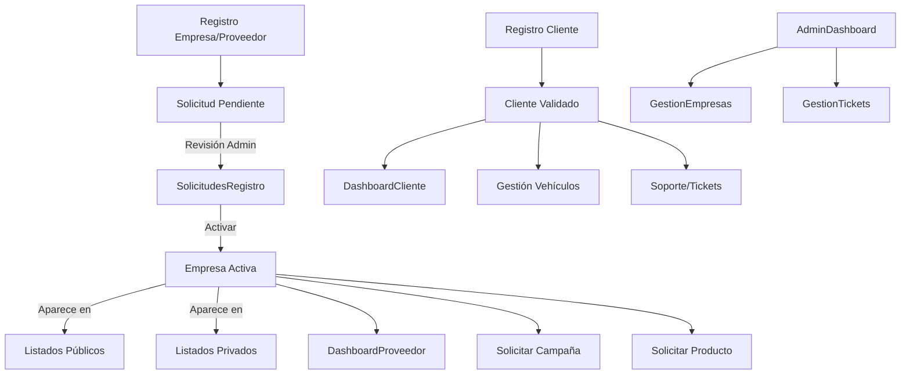

# Análisis Completo del Proyecto AV10 de Julio

## 1. Estructura General del Proyecto

- **Frontend:** React, Tailwind CSS, React Router.
- **Backend:** Firebase Firestore.
- **Carpetas principales:**
  - `src/pages/`: Páginas principales (Home, dashboards, perfiles, listados, etc).
  - `src/components/`: Componentes reutilizables y específicos de cada flujo.
  - `src/routes/`: Definición de rutas protegidas y públicas.
  - `src/utils/`, `src/hooks/`, `src/services/`: Utilidades, hooks y servicios.
  - `public/`: Recursos estáticos.

---

## 2. Pantallas y Flujos por Rol

### 2.1. Público/No autenticado
- HomePage, LocalProvidersPage, PerfilEmpresaPublica, servicios públicos, recursos, contacto, FAQ, tickets, registro de empresa/proveedor y cliente.

### 2.2. Cliente
- DashboardCliente, gestión de vehículos, estado de validación, tickets.

### 2.3. Proveedor/Empresa
- DashboardProveedorMejorado, MiEmpresaPage, solicitud de campañas/productos, edición de campañas/productos.

### 2.4. Administrador
- AdminDashboardPage, EmpresasTable/ListadoProveedoresAdmin, SolicitudesRegistro, GestionTiposEmpresa, AdminNuevaCampaña, gestión de notificaciones, marcas, categorías, usuarios y campañas.

---

## 3. Flujos Principales (Diagrama)

---

## 4. Listado de Pendientes y Propuestas

### Pendientes
1. Unificación de campos y normalización.
2. Mejorar validaciones en formularios.
3. Optimización de consultas a Firestore.
4. Mejorar manejo de galería de imágenes.
5. Accesibilidad y usabilidad.
6. Notificaciones push.
7. Auditoría de roles y permisos.
8. Documentación técnica.
9. Pruebas automatizadas.
10. Internacionalización.

### Propuestas
- Panel de analítica avanzada.
- Sistema de reputación y reviews.
- Integración con sistemas externos.
- Onboarding guiado.
- Mejorar mobile/responsive.
- Sistema de alertas y recordatorios.
- Gestión avanzada de campañas y promociones.

---

*Este documento puede ser copiado y pegado en Word. El diagrama puede ser visualizado con la extensión de Mermaid para Word o convertido a imagen usando herramientas online.*
