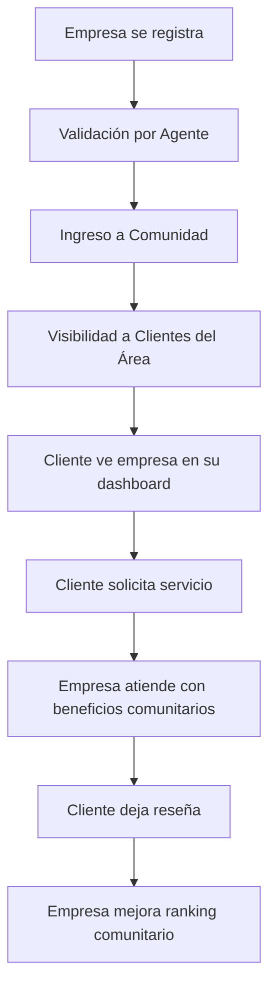
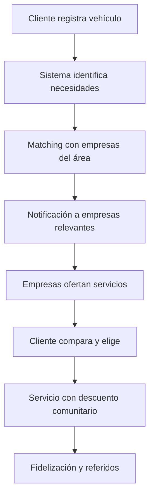

# 🤝 ARQUITECTURA DE COMUNIDAD - AV10 DE JULIO

## 🎯 CONCEPTO CENTRAL

**AV10 de Julio** es una **comunidad automotriz integrada** donde empresas de todos los tamaños (emprendimientos, pymes, locales, grandes empresas) y clientes con vehículos forman un ecosistema colaborativo.

---

## 🏗️ ESTRUCTURA DE LA COMUNIDAD

### 👥 **MIEMBROS DE LA COMUNIDAD**

#### 🏢 **EMPRESAS** (Todos en colección `empresas`)
```javascript
// Clasificación por tamaño y recursos
const tiposEmpresa = {
  emprendimiento: {
    caracteristicas: ['1-2 personas', 'recursos limitados', 'servicios básicos'],
    beneficios: ['acceso gratuito limitado', 'capacitaciones', 'mentorías'],
    limitaciones: ['10 clientes/mes', '1 campaña/mes', 'analytics básicos']
  },
  pyme: {
    caracteristicas: ['3-10 personas', 'establecimiento físico', 'servicios especializados'],
    beneficios: ['acceso premium básico', 'soporte email', 'eventos exclusivos'],
    limitaciones: ['50 clientes/mes', '3 campañas/mes', 'analytics intermedios']
  },
  local: {
    caracteristicas: ['10+ personas', 'marca establecida', 'múltiples servicios'],
    beneficios: ['acceso premium', 'soporte chat', 'preferencia en búsquedas'],
    limitaciones: ['200 clientes/mes', '5 campañas/mes', 'analytics avanzados']
  },
  empresa_grande: {
    caracteristicas: ['50+ personas', 'múltiples sucursales', 'servicios integrales'],
    beneficios: ['acceso enterprise', 'soporte dedicado', 'integración API'],
    limitaciones: ['ilimitado', 'campañas ilimitadas', 'analytics premium']
  }
}
```

#### 👨‍💼 **CLIENTES** (Colección `perfiles_clientes`)
```javascript
// Propietarios de vehículos que necesitan servicios
const perfilCliente = {
  rol: 'generador de demanda',
  aporta: ['necesidades reales', 'feedback', 'volumen de servicios'],
  recibe: ['servicios de calidad', 'precios preferenciales', 'soporte comunitario'],
  compromiso: ['mantener vehículos registrados', 'participar en reseñas', 'referir otros clientes']
}
```

#### 👨‍🔧 **AGENTES DE CAMPO** (Colección `agentes`)
```javascript
// Validadores y conectores del ecosistema
const rolAgente = {
  funcion: 'validar empresas y facilitar conexiones',
  responsabilidades: ['verificar calidad', 'mediar conflictos', 'onboarding'],
  herramientas: ['app móvil', 'checklist de validación', 'sistema de scoring']
}
```

---

## 🔄 FLUJOS DE INTERACCIÓN COMUNITARIA

### 📈 **FLUJO EMPRESA → CLIENTE**



### 📉 **FLUJO CLIENTE → EMPRESA**



---

## 🏆 SISTEMA DE BENEFICIOS ESCALONADOS

### 💰 **MODELO FREEMIUM COMUNITARIO**

| Nivel | Precio/Mes | Clientes | Campañas | Analytics | Soporte |
|-------|------------|----------|----------|-----------|---------|
| **Emprendimiento** | $0 | 10 | 1 | Básico | Comunidad |
| **Pyme** | $15.000 | 50 | 3 | Intermedio | Email |
| **Local** | $35.000 | 200 | 5 | Avanzado | Chat |
| **Empresa** | $75.000 | ∞ | ∞ | Premium | Dedicado |

### 🎁 **BENEFICIOS TRANSVERSALES**

#### Para **TODAS las Empresas**:
- ✅ Acceso a base de clientes reales del área
- ✅ Sistema de reputación comunitaria
- ✅ Red de referidos entre empresas
- ✅ Capacitaciones gratuitas mensuales
- ✅ Eventos de networking comunitario

#### Para **TODOS los Clientes**:
- ✅ Descuentos exclusivos con empresas miembro
- ✅ Servicios prioritarios
- ✅ Garantía comunitaria (mediación en conflictos)
- ✅ Programa de puntos por fidelidad
- ✅ Acceso a promociones especiales

---

## 🔗 INTEGRACIONES Y SYNERGIAS

### 🤝 **COLABORACIÓN INTER-EMPRESARIAL**

```javascript
// Sistema de derivaciones automáticas
const redColaboracion = {
  taller_mecanico: ['venta_repuestos', 'servicios_grua', 'seguros'],
  venta_repuestos: ['taller_mecanico', 'vulcanizacion', 'car_detailing'],
  seguros: ['taller_mecanico', 'peritajes', 'servicios_legales'],
  // Cada empresa puede derivar clientes y recibir comisión
}
```

### 📊 **MÉTRICAS COMUNITARIAS**

```javascript
// KPIs del ecosistema
const metricasComunidad = {
  salud_ecosystem: {
    empresas_activas: 85, // % empresas con actividad mensual
    satisfaccion_clientes: 4.2, // Rating promedio
    interacciones_mes: 1200, // Servicios realizados
    crecimiento_organico: 15 // % nuevos miembros por referidos
  },
  impacto_economico: {
    volumen_transacciones: 45000000, // Pesos chilenos/mes
    empleos_generados: 230, // Empleos directos en empresas miembro
    ahorro_clientes: 25, // % promedio de ahorro vs precios regulares
    revenue_platform: 12500000 // Ingresos por suscripciones
  }
}
```

---

## 🎯 OBJETIVOS ESTRATÉGICOS 2025

### 📈 **Q1 2025** (Sprint 3-4)
- [ ] **200 empresas** de todos los tamaños en la comunidad
- [ ] **1,000 clientes** activos con vehículos registrados
- [ ] **Sistema de beneficios** completamente implementado
- [ ] **Monetización básica** funcionando

### 📈 **Q2 2025** (Sprint 5-8)
- [ ] **500 empresas** con diferenciación clara por tamaño
- [ ] **3,000 clientes** usando servicios comunitarios
- [ ] **Red de derivaciones** automática funcionando
- [ ] **App móvil** para agentes y empresas

### 📈 **Q3-Q4 2025** (Sprint 9-16)
- [ ] **1,000 empresas** en toda la comuna
- [ ] **10,000 clientes** activos
- [ ] **Marketplace interno** entre empresas
- [ ] **Expansión geográfica** a otras comunas

---

## 🛠️ IMPLEMENTACIÓN TÉCNICA

### 🗃️ **ESTRUCTURA DE DATOS UNIFICADA**

```javascript
// Colección empresas (ÚNICA para todos los tipos)
const empresaSchema = {
  // Datos básicos
  id: 'string',
  nombre: 'string',
  rut: 'string',
  email: 'string',
  
  // Clasificación comunitaria
  tipo_empresa: 'emprendimiento|pyme|local|empresa_grande',
  es_comunidad: boolean,
  fecha_ingreso_comunidad: timestamp,
  estado_comunidad: 'activo|suspendido|probation',
  
  // Nivel de suscripción y beneficios
  nivel_suscripcion: 'freemium|basico|premium|enterprise',
  beneficios_activos: [],
  limites_mensuales: {
    clientes: number,
    campanas: number,
    analytics_nivel: string
  },
  
  // Métricas comunitarias
  ranking_comunidad: number,
  puntuacion_total: number,
  servicios_realizados: number,
  rating_promedio: number,
  
  // Ubicación y servicios
  zona_geografica: string,
  servicios_ofrecidos: [],
  horarios: {},
  contacto: {}
}
```

### 🔄 **LÓGICA DE NEGOCIO COMUNITARIA**

```javascript
// Funciones principales del sistema comunitario
const CommunityService = {
  // Matching automático cliente-empresa
  async matchClientWithBusinesses(clienteId, necesidad) {
    const cliente = await getCliente(clienteId);
    const empresasCercanas = await getEmpresasByZona(cliente.zona);
    const empresasCompatibles = empresasCercanas.filter(e => 
      e.servicios_ofrecidos.includes(necesidad) && 
      e.es_comunidad && 
      e.estado_comunidad === 'activo'
    );
    return empresasCompatibles.sort((a, b) => b.ranking_comunidad - a.ranking_comunidad);
  },
  
  // Cálculo de beneficios por nivel
  calculateBeneficios(tipoEmpresa, nivelSuscripcion) {
    const base = BENEFICIOS_BASE[tipoEmpresa];
    const premium = BENEFICIOS_PREMIUM[nivelSuscripcion];
    return { ...base, ...premium };
  },
  
  // Sistema de referidos y comisiones
  async processReferral(empresaReferidora, clienteReferido, servicioRealizado) {
    const comision = calcularComision(servicioRealizado);
    await creditarComision(empresaReferidora, comision);
    await actualizarRanking(empresaReferidora, 'referido_exitoso');
  }
}
```

---

## 📱 EXPERIENCIA DE USUARIO COMUNITARIA

### 🏢 **DASHBOARD EMPRESARIAL ADAPTATIVO**

```javascript
// Mismo componente, diferentes capacidades
const DashboardEmpresa = ({ empresa }) => {
  const beneficios = getBeneficiosByTipo(empresa.tipo_empresa);
  
  return (
    <Dashboard>
      {/* Todos ven */}
      <ClientesArea limite={beneficios.clientes_mes} />
      <ReputacionComunitaria />
      
      {/* Solo PYME+ */}
      {beneficios.analytics_nivel !== 'basico' && <AnalyticsAvanzados />}
      
      {/* Solo LOCAL+ */}
      {beneficios.campanas_premium && <CampanasPremium />}
      
      {/* Solo EMPRESA */}
      {beneficios.integracion_api && <APIManager />}
    </Dashboard>
  );
};
```

### 👨‍💼 **EXPERIENCIA DEL CLIENTE**

```javascript
// Dashboard comunitario del cliente
const DashboardCliente = ({ cliente }) => {
  return (
    <Dashboard>
      <MisVehiculos />
      <EmpresasCercanas tipo="comunidad" />
      <OfertasExclusivas source="comunidad" />
      <HistorialServicios mostrar="beneficios_aplicados" />
      <ProgramaPuntos />
      <ReferirAmigos />
    </Dashboard>
  );
};
```

---

*Este documento define la arquitectura de comunidad que sustenta toda la plataforma AV10 de Julio como un ecosistema colaborativo real.*

**Fecha**: 19 de Julio, 2025  
**Versión**: 2.0 - Actualizada con concepto comunitario  
**Estado**: Implementación en progreso (Sprint 2 completado)
